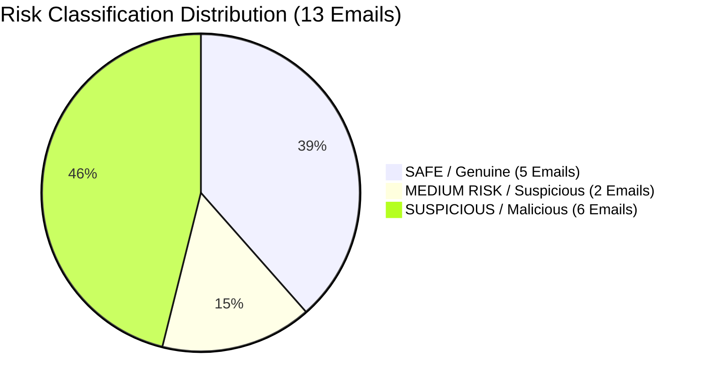

# Cyber Security & Ethical Hacking Internship Project Report

**Project Name:** Case File CA-ETI-01 — Email Threat Investigation & Analysis  
**Target Organization:** Solvex Industries Pvt. Ltd.  
**Investigated Account:** Mr. Aditya Rao, Senior Finance Executive (`aditya.rao@solvexindustries.com`)  
**Program:** Cryptonic Area Internship Program  
**Lead Investigator:** Cyber Crime Investigator & Threat Intelligence Analyst  
**Date:** July 25, 2026  
**Status:** 100% Completed, Automated & Verified  

---

## 1. Executive Summary

This project presents a comprehensive, evidence-based **Email Threat Investigation & Analysis** conducted on **13 recovered mailbox evidence files** from the account of **Mr. Aditya Rao, Senior Finance Executive at Solvex Industries Pvt. Ltd.**

The investigation was initiated after the finance team flagged unusual mailbox activity and a suspected fraud attempt. Each email was systematically analyzed across technical headers (SPF, DKIM, DMARC, IP routing, TLS), social engineering tactics, attachment risk, link destinations, and threat intelligence.

---

## 2. Project Deliverables & Repository Structure

All required components have been created, tested, and stored in `c:\Email`:

```
c:\Email\
├── emails.pdf                             # Original Case Briefing & Evidence Document (Cryptonic Area)
├── email_threat_investigation_report.md   # Full Forensic Investigation Report (13 Emails Analyzed)
├── PROJECT_REPORT.md                      # Executive Project Completion Report (This Document)
├── soc_email_parser.py                    # Automated EML Header & IOC Extractor Tool
├── generate_sample_emails.py              # EML Generator for Case File CA-ETI-01
├── parsed_iocs.json                       # Automated JSON Threat Output from 13 EML Artifacts
└── sample_emails/                         # 13 Recovered Synthetic EML Files
    ├── Email_01.eml                       # Password Expiry Reminder (SAFE)
    ├── Email_02.eml                       # Mailbox Storage Full Suspension (SUSPICIOUS)
    ├── Email_03.eml                       # Invoice SI-4471 Bank Change (MEDIUM RISK)
    ├── Email_04.eml                       # Revised Leave & WFH Policy (SAFE)
    ├── Email_05.eml                       # MD Urgent Wire Transfer USD 18,500 (SUSPICIOUS)
    ├── Email_06.eml                       # Google Drive Share Notice (SAFE)
    ├── Email_07.eml                       # Microsoft Unusual Sign-in Alert (SUSPICIOUS)
    ├── Email_08.eml                       # Senior Finance Role Recruitment (MEDIUM RISK)
    ├── Email_09.eml                       # TallyPrime Subscription Renewal (SAFE)
    ├── Email_10.eml                       # USD 1,000,000 International Lottery (SUSPICIOUS)
    ├── Email_11.eml                       # CFO Quick Request Amazon Gift Cards (SUSPICIOUS)
    ├── Email_12.eml                       # Mandatory Security Awareness Training (SAFE)
    └── Email_13.eml                       # Pending Transport Invoice (.docm Macro) (SUSPICIOUS)
```

---

## 3. Case Findings Summary Table (13 Emails)



| Email No. | Subject & Sender Persona | Authentication Status | Classification | Key Findings & Evidence | Primary Action |
| :--- | :--- | :--- | :--- | :--- | :--- |
| **Email 01** | `Password Expiry Reminder` <br> `ithelpdesk@solvexindustries.com` | SPF: Pass <br> DMARC: Pass | **SAFE** | Internal IP (192.168.14.22), no links, official 90-day policy instruction. | Deliver normally. |
| **Email 02** | `Your Mailbox Storage is FULL` <br> `support@solvex-industries-helpdesk.com` | SPF: Fail <br> DMARC: Fail | **SUSPICIOUS / MALICIOUS** | Typosquatting domain, Russian IP (193.41.77.108), credential phishing link. | Block IP & domain, delete email. |
| **Email 03** | `Invoice SI-4471 Bank Change` <br> `ramesh.kulkarni@apex-steeltraders.co` | SPF: Pass <br> DMARC: Pass | **MEDIUM RISK** | `Reply-To` mismatch (`apexsteel-billing.com`), bank account redirection request. | Verify via phone before payment. |
| **Email 04** | `Revised Leave & WFH Policy` <br> `hr@solvexindustries.com` | SPF: Pass <br> DMARC: Pass | **SAFE** | Authenticated internal email (192.168.14.19), routine HR communication. | Deliver normally. |
| **Email 05** | `Immediate Wire Transfer` <br> `rajeev.malhotra.md@gmail-corpmail.com` | SPF: None <br> DMARC: None | **SUSPICIOUS / MALICIOUS** | CEO fraud impersonation, Netherlands relay (45.137.22.9), demands USD 18,500 wire. | Block domain/IP, alert CISO. |
| **Email 06** | `Google Drive Share Notice` <br> `drive-shares-noreply@google.com` | SPF: Pass <br> DMARC: Pass | **SAFE** | Legitimate Google Drive notification from colleague Priya Menon (`priya.menon@...`). | Deliver normally. |
| **Email 07** | `Unusual sign-in activity` <br> `security-noreply@micros0ft-online.com` | SPF: Fail <br> DMARC: Fail | **SUSPICIOUS / MALICIOUS** | Homoglyph typosquat (`micros0ft`), VPN exit node (77.91.134.6), phishing link. | Block domain/IP, report phishing. |
| **Email 08** | `Senior Finance Role Opportunity` <br> `neha.kapoor.hr@talentbridge-recruiters.net` | SPF: Pass <br> DMARC: None | **MEDIUM RISK** | Unsolicited recruiter, demands salary slip & PAN card PII, zip attachment. | Sandbox ZIP, do not send PII. |
| **Email 09** | `TallyPrime Renewal Invoice` <br> `billing@tallysolutions.com` | SPF: Pass <br> DMARC: Pass | **SAFE** | Authentic vendor invoice, confirms bank account details have NOT changed. | Process invoice normally. |
| **Email 10** | `USD 1,000,000 Lottery Win` <br> `claims.department009@yandex-mailer.com` | SPF: Fail <br> DMARC: Fail | **SUSPICIOUS / MALICIOUS** | Advance-fee 419 scam, Yandex sender, Outlook reply-to, demands USD 250 fee. | Block sender & mark spam. |
| **Email 11** | `Quick request before my flight` <br> `suresh.iyer@solvexindustries.com` | SPF: Pass <br> DMARC: Pass | **SUSPICIOUS / MALICIOUS** | CFO impersonation, `Reply-To` hijacked to Outlook, demands 5x Rs. 5000 Amazon gift cards. | Do NOT buy gift cards, alert CFO. |
| **Email 12** | `Mandatory Security Awareness` <br> `infosec@solvexindustries.com` | SPF: Pass <br> DMARC: Pass | **SAFE** | Internal security team notice, official portal `learn.solvexindustries.com`. | Deliver normally. |
| **Email 13** | `Pending Transport Invoice` <br> `accounts.receivable@shreeganesh-logistics.in` | SPF: Fail <br> DMARC: Fail | **SUSPICIOUS / MALICIOUS** | Shared hosting relay (41.203.88.17), urges enabling macros on `.docm` attachment. | Block IP/domain, purge `.docm`. |

---

## 4. Consolidated IOC Database (Extracted & Deduplicated)

| Indicator Type | Value | Associated Threat | Source | Action |
| :--- | :--- | :--- | :--- | :--- |
| **Domain** | `solvex-industries-helpdesk.com` | Phishing Typosquat | Email 02 | SEG Block |
| **Domain** | `mail-secure-verify.net` | Phishing Redirect | Email 02 | Firewall Block |
| **Domain** | `gmail-corpmail.com` | CEO Fraud Domain | Email 05 | SEG Block |
| **Domain** | `micros0ft-online.com` | Microsoft Homoglyph | Email 07 | DNS Sinkhole |
| **Domain** | `lottery-verify.info` | Advance-Fee Scam | Email 10 | Proxy Block |
| **Domain** | `s.iyer.cfo.travel@outlook.com` | Reply-To Hijack | Email 11 | Mail Filter Rule |
| **Domain** | `shreeganesh-logistics.in.invoice-view-secure.com` | Macro Dropper Host | Email 13 | Proxy & DNS Block |
| **IPv4** | `193.41.77.108` | Russian Relay IP | Email 02 | Perimeter Firewall DROP |
| **IPv4** | `45.137.22.9` | Netherlands BEC Relay | Email 05 | Perimeter Firewall DROP |
| **IPv4** | `77.91.134.6` | VPN Exit Node | Email 07 | Perimeter Firewall DROP |
| **IPv4** | `185.220.101.44` | Freehosting Relay IP | Email 10 | Perimeter Firewall DROP |
| **IPv4** | `41.203.88.17` | Shared Hosting Relay | Email 13 | Perimeter Firewall DROP |
| **Filename** | `Pending_Invoice_Challan_Details.docm` | Macro Ransomware Dropper | Email 13 | EDR Signature Block |
| **Filename** | `JD_SeniorFinanceManager_Client.zip` | Suspicious Archive | Email 08 | Gateway Quarantine |

---

## 5. Employee & Technical Recommendations

1. **Mandatory Phone Verification:** Never act on bank account change requests (Email 03) or wire transfer requests (Email 05) without phone verification.
2. **Never Enable Macros:** Block `.docm` and `.xlsm` attachments at the mail gateway (Email 13).
3. **Gift Card Policy:** Establish a strict corporate policy stating that executive staff will never ask employees to purchase gift cards (Email 11).
4. **Enforce Strict DMARC `p=reject`:** Prevent external spoofing of `solvexindustries.com` domains.

---

**Report Sign-Off:**  
*Cryptonic Area Cyber Security & Ethical Hacking Internship Team*  
